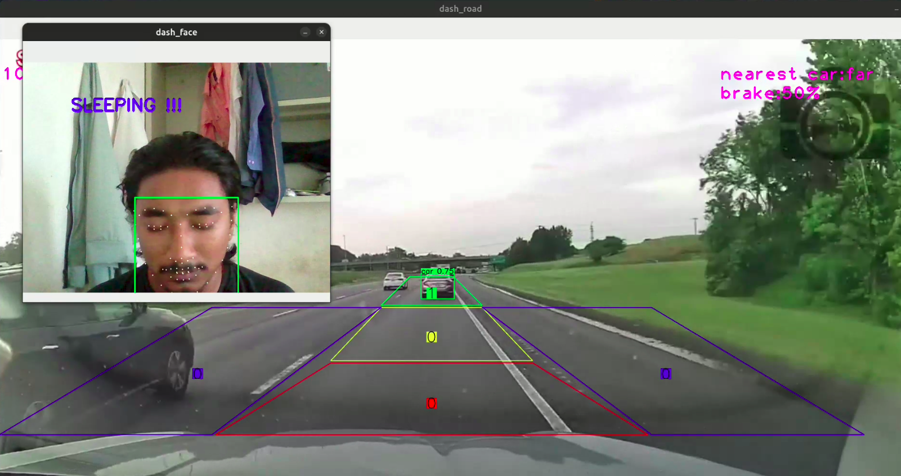
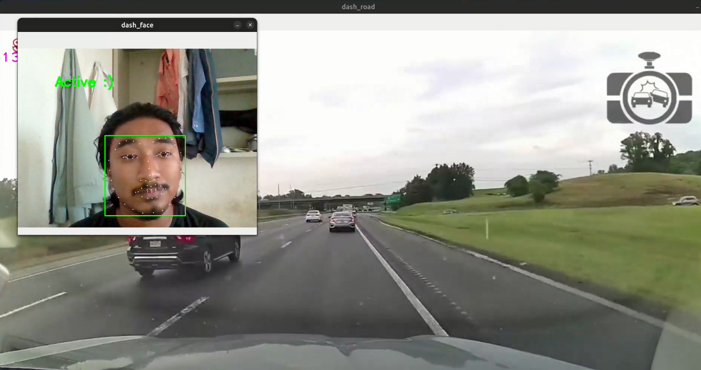

# Smart Driver Assistance System

|  |  |
|:-------------------:|:-------------------:|
|      Sleeping       |        Awake        |

## Overview

The Smart Driver Assistance System is a project designed to enhance road safety by detecting driver drowsiness and assisting in object detection on the road. This repository contains the source code for the system, which combines computer vision techniques with machine learning algorithms to address the critical issue of drowsy driving.

## Features

- **Drowsiness Detection**: Utilizes facial landmark detection to monitor the driver's eye blinking patterns, determining whether they are drowsy, active, or asleep.
  
- **Object Detection**: Employs the YOLO (You Only Look Once) v8 model to detect objects on the road, such as vehicles (Car, Bus, Truck Motorcycle and Cycle) and pedestrians, providing real-time analysis of potential hazards.

## Setup

1. **Requirements**: Ensure you have Python installed along with the necessary libraries specified in `requirements.txt`.

2. **Clone the Repository**: Clone this repository to your local machine.

3. **Download Pre-trained Models**: Download the pre-trained YOLO model (`yolov8n.pt`) and the facial landmark detection model (`shape_predictor_68_face_landmarks.dat`) and place them in the respective directories.

4. **Install Dependencies**: Install the required Python libraries by running:
pip install -r requirements.txt

5. **Run the System**: Execute the `main.py` script to start the Smart Driver Assistance System.
6. **Adjustments**: You have to make necessary adjustments in the `dash.py` file for setting different segments in for detection.

## Usage

- To use the system, run the `main.py` script with appropriate video inputs for the dashcam and the front-facing camera.
- Monitor the output windows to observe real-time drowsiness detection and object detection results.

## Contributing

Contributions are welcome! If you have ideas for improvements or encounter any issues, feel free to open an issue or submit a pull request.

## Acknowledgements

- This project makes use of the [YOLO](https://github.com/ultralytics/ultralytics) object detection model and the [dlib](http://dlib.net/) library for facial landmark detection.

